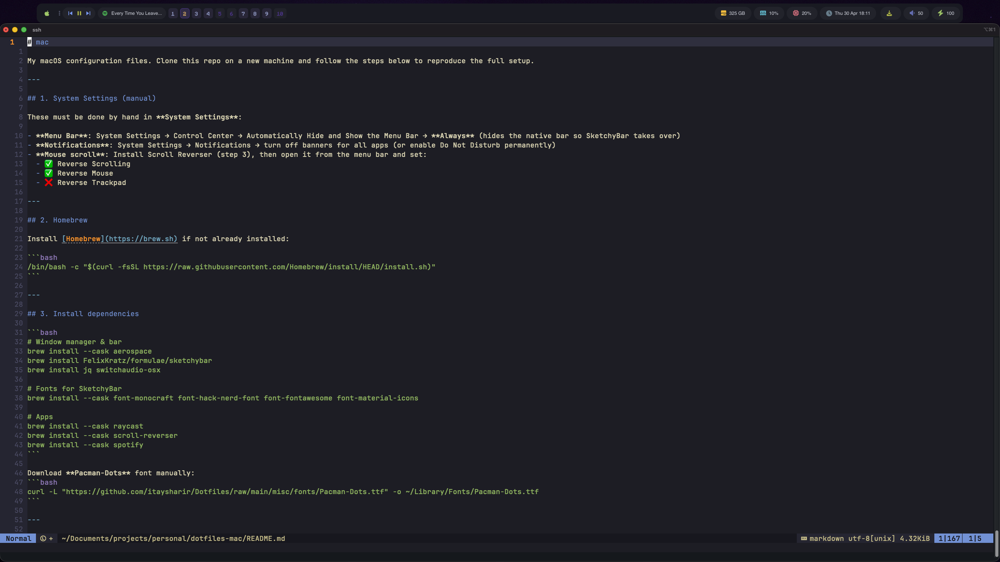

# mac

My macOS configuration files. Clone this repo on a new machine and follow the steps below to reproduce the full setup.



---

## 1. System Settings (manual)

These must be done by hand in **System Settings**:

- **Menu Bar**: System Settings → Control Center → Automatically Hide and Show the Menu Bar → **Always** (hides the native bar so SketchyBar takes over)
- **Notifications**: System Settings → Notifications → turn off banners for all apps (or enable Do Not Disturb permanently)
- **Mouse scroll**: Install Scroll Reverser (step 3), then open it from the menu bar and set:
  - ✅ Reverse Scrolling
  - ✅ Reverse Mouse
  - ❌ Reverse Trackpad

---

## 2. Homebrew

Install [Homebrew](https://brew.sh) if not already installed:

```bash
/bin/bash -c "$(curl -fsSL https://raw.githubusercontent.com/Homebrew/install/HEAD/install.sh)"
```

---

## 3. Install dependencies

```bash
# Window manager & bar
brew install --cask aerospace
brew install FelixKratz/formulae/sketchybar
brew install jq switchaudio-osx

# Fonts for SketchyBar
brew install --cask font-monocraft font-hack-nerd-font font-fontawesome font-material-icons

# Apps
brew install --cask raycast
brew install --cask scroll-reverser
brew install --cask spotify
```

Download **Pacman-Dots** font manually:
```bash
curl -L "https://github.com/itaysharir/Dotfiles/raw/main/misc/fonts/Pacman-Dots.ttf" -o ~/Library/Fonts/Pacman-Dots.ttf
```

---

## 4. Clone and symlink configs

```bash
git clone https://github.com/MarceloSavian/mac.git ~/mac

# AeroSpace
ln -sf ~/mac/.aerospace.toml ~/.aerospace.toml

# SketchyBar
mkdir -p ~/.config
ln -sf ~/mac/.config/sketchybar ~/.config/sketchybar

# Shell
ln -sf ~/mac/.zshrc ~/.zshrc
ln -sf ~/mac/.zprofile ~/.zprofile

# Git
ln -sf ~/mac/.gitconfig ~/.gitconfig
```

---

## 5. Scroll Reverser preferences

```bash
cp ~/mac/Library/Preferences/com.pilotmoon.scroll-reverser.plist ~/Library/Preferences/
```

Then open Scroll Reverser from Applications and enable it from the menu bar.

---

## 6. Start services

```bash
brew services start sketchybar
```

---

## 7. Wallpaper rotation

```bash
mkdir -p ~/Pictures/wallpapers
cp ~/mac/wallpapers/* ~/Pictures/wallpapers/
mkdir -p ~/scripts
cp ~/mac/scripts/wallpaper.sh ~/scripts/wallpaper.sh
chmod +x ~/scripts/wallpaper.sh
cp ~/mac/LaunchAgents/com.marcelosavian.wallpaper.plist ~/Library/LaunchAgents/
launchctl load ~/Library/LaunchAgents/com.marcelosavian.wallpaper.plist
```

Wallpaper rotates randomly every 10 minutes across all images in `~/Pictures/wallpapers/`.

---

## 8. Raycast (manual)

- Open Raycast and set its hotkey to **Option+D**
- Install the **Script Commands** extension and add `~/.config/raycast/scripts` as a script directory (for the "New Window" command)

---

## 9. Neovim config

Neovim has its own repo:

```bash
git clone https://github.com/MarceloSavian/nvim.git ~/.config/nvim
```

---

## What's included

| File | Description |
|------|-------------|
| `.aerospace.toml` | AeroSpace tiling window manager |
| `.config/sketchybar/` | SketchyBar status bar (Pacman theme) |
| `Library/Preferences/com.pilotmoon.scroll-reverser.plist` | Scroll Reverser settings |
| `LaunchAgents/com.marcelosavian.wallpaper.plist` | Wallpaper rotation every 10 min |
| `scripts/wallpaper.sh` | Picks a random wallpaper from `~/Pictures/wallpapers/` |
| `.zshrc` | ZSH shell config |
| `.zprofile` | ZSH profile (PATH setup) |
| `.gitconfig` | Git config |

---

## Bar layout (SketchyBar — Pacman theme)

- **Left**: workspaces (1–10) · Apple menu · Spotify controls
- **Right**: now playing · battery · volume · brew updates · clock · CPU · RAM · disk

Workspaces 1–5 → external monitor · Workspaces 6–10 → laptop screen

---

## Keybindings (AeroSpace)

| Shortcut | Action |
|----------|--------|
| `Alt+1–9, Alt+0` | Switch to workspace 1–10 |
| `Alt+Shift+1–9, Alt+Shift+0` | Move window to workspace (focus follows) |
| `Alt+H/J/K/L` | Focus window left/down/up/right |
| `Alt+Shift+H/J/K/L` | Move window left/down/up/right |
| `Alt+Minus / Alt+Equal` | Resize window |
| `Alt+/` | Toggle horizontal/vertical tile layout |
| `Alt+,` | Toggle accordion layout |
| `Alt+Tab` | Switch to previous workspace |
| `Alt+D` | Open Raycast |
| `Alt+Q` | Quit focused app |
| `Alt+Return` | Open new iTerm2 window |
| `Alt+Shift+R` | Reload AeroSpace config |
| `Alt+Shift+;` | Enter service mode |
